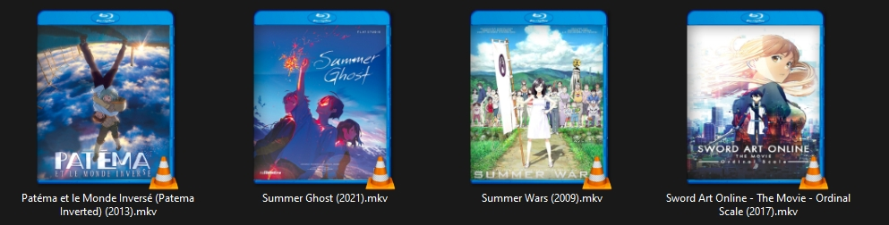
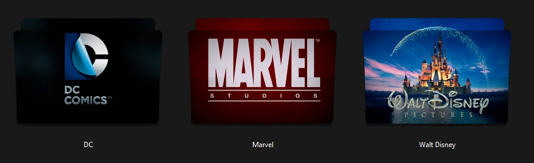

# Packs d'icone pour dossiers/vidéo

**Blu-Ray Demo :** 
**Dossier Demo :** 
**Crée par :** <Gs> Kizuna 
**Liens :** N/A 

**Informations sur le pack :**

 

**Liste de lien :**

* [Bonus](#bonus)
* [Dossiers Cover](#dossiers-cover)
* [Blu-Ray Cover](#blu-ray-cover)
* [Liste des Dossiers](#dossiers-liste)
* [Liste des Blu-Ray](#blu-ray-liste)

 

## Bonus
**Nombre Total :** 23 
**Format :** png/psd 
**Type :** N/A 
**Dimensions :**

* **png :** Divers (32 bits)

 

## Dossiers Cover
**Nombre Total :** 18 (3 par Format/Type) 
**Format :** png/ico/icns 
**Type :** Normal/Gloss 
**Dimensions :**

* **png :** 512x512 (32 bits)  
* **ico :** 512x512 (32 bits), 256x256 (32 bits),
        128x128 (32 bits), 96x96 (32 bits), 72x72 (32 bits), 
        64x64 (32 bits), 48x48 (32/8 bits), 40x40 (32 bits),
        32x32 (32/8/4 bits), 24x24 (32 bits), 20x20 (32 bits), 
        16x16 (32/8/4 bits)  
* **icns :** 512x512 (png), 512x512 @x2 (png), 256x256 (png),
         256x256 @x2 (png), 128x128 (png), 128x128 @x2 (png), 
         128x128 (32 bits), 64x64 (png), 48x48 (32/8/4 bits),
         32x32 (32/8/4 bits), 32x32 (png), 32x32 @x2 (png), 
         24x24 (32 bits), 16x16 (png), 16x16 @x2 (png), 16x16 (32/8/4 bits)

 

## Dossiers Liste

| Titre | Nombre de fichier |
| --- | :-: |
| DC Comics | 1 |
| Marvel Studios | 1 |
| WallDisney Pictures | 1 |

 

## Blu-Ray Cover
**Nombre Total :** 13 
**Format :** png 
**Type :** Normal 
**Dimensions :**

* **png :** 396x512 (32 bits)

 

## Blu-Ray Liste

| Titre | Année de sortie | Nombre de fichier |
| --- | --: | :-: |
| À la poursuite de demain | 2015 | 1 |
| Assassin's Creed | 2017 | 1 |
| Big | 2001 | 1 |
| Chair de Poule | 2016 | 1 |
| E.T. L'Extra-Terrestre | 1982 | 1 |
| Event Horizon - Le Vaisseau de l'Au-dela | 1997 | 1 |
| Hitman Agent 47 | 2015 | 1 |
| Independence day | 1996 | 1 |
| Independence day resurgence | 2016 | 1 |
| La montagne ensorcelee | 2009 | 1 |
| Perdus dans l'espace | 1998 | 1 |
| Ready Player One | 2018 | 2 |
